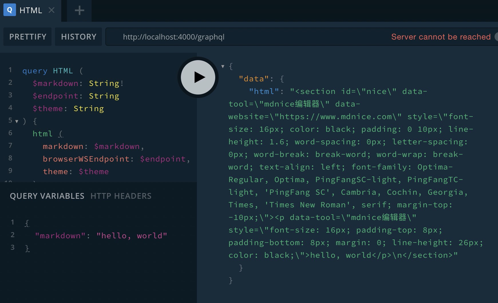

# Mardown to HTML API

> Powerd by [mdnice](https://www.mdnice.com)

根据 `mardown` 生成美化 `html` 的 API 服务。

## API

### mardown to html

``` gql
query HTML (
  $markdown: String!
  $endpoint: String
  $theme: String
) {
  html (
    markdown: $markdown, 
    browserWSEndpoint: $endpoint,
    theme: $theme
  )
}
```



## Deploy

本项目部署在腾讯云 serverless 中，访问地址: <https://service-1sbq8kkt-1257314149.sh.apigw.tencentcs.com/graphql>

部署资源配置文件 `serverless.yml` 如下所示:

``` yml
component: express # (required) name of the component. In that case, it's express.
name: markdown-to-html-api
org: shanyue

inputs:
  src: ./ # (optional) path to the source folder. default is a hello world app.
  functionName: mardown-api
  region: ap-shanghai
  runtime: Nodejs12.16
  exclude:
    - .env
  functionConf:
    timeout: 200
    memorySize: 128
  apigatewayConf:
    protocols:
      - http
      - https
    environment: release
    enableCORS: true #  允许跨域
```
